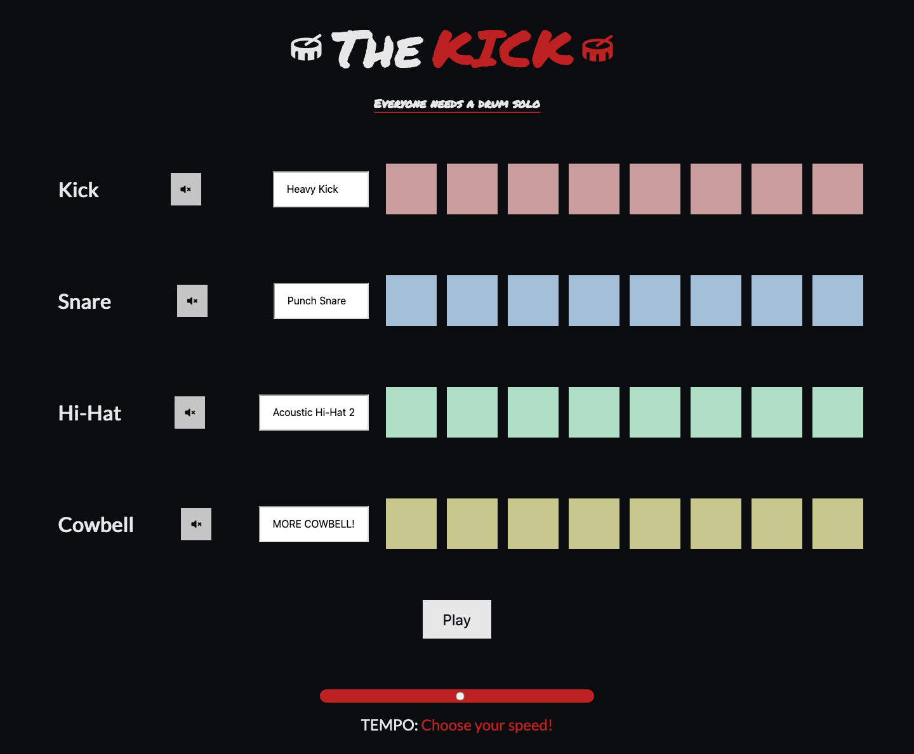

# 'The Kick' Drum Beatmaker

JavaScript drum beatmaker app with multiple audio combinations, sound muting and tempo adjustment.

Why? Because everyone loves a good drum solo, right? This JavaScript drum beat maker app tapped (pun intended) into my love of music and expanded upon my growing JS functional and OOP awareness. I got a real "kick" out of making this (ok, I'll stop!) and building features like multiple audio file combinations, sound muting on individual tracks and tempo adjustment.

**Tech: HTML, CSS, JavaScript, deployed on GitHub Pages.**
